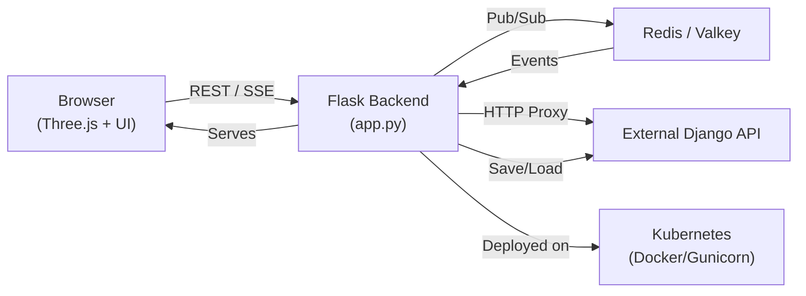

# Simple Town Builder - Application Summary

## Overview
A web-based 3D town building tool that lets users interactively place buildings, roads, parks, and props via drag-and-drop.  
It supports editing, deletion, saving/loading of layouts, and real-time collaborative updates across multiple clients.

## Frontend Architecture
- Built with Three.js and custom JavaScript modules (`main.js`, `scene.js`, `controls.js`, `ui.js`).  
- Provides **Place**, **Edit**, and **Delete** modes for manipulating objects in a WebGL scene.  
- Keyboard (WASD/arrow keys) and mouse controls for camera navigation.  
- Communicates with the Flask backend via REST APIs and Server-Sent Events (SSE).

## Backend Architecture
- Python Flask application (`app.py`) serving HTML templates and REST endpoints.  
- **Model discovery**: scans `static/models/` for available GLTF assets (`get_available_models()`).  
- **API routes** under `/api/`:
  - `/api/models`: list of available model categories and file names.  
  - `/api/town`: GET returns current layout, POST updates state.  
  - `/api/town/save` & `/api/town/load`: proxy to external Django API.  
  - `/api/config`: returns configuration like API URL and token.  
  - `/api/proxy/towns`: generic proxy for CRUD operations to external API.  
  - `/api/town/model`: DELETE and PUT endpoints to remove/edit custom models.  
- Serves SSE stream at `/api/events` for broadcasting `town_events`.

## Real-Time Collaboration
- Uses Redis Pub/Sub channel (`town_events`) for state change notifications.  
- Python threads publish updates to Redis and SSE subscribers via `event_stream()`.  
- Connected clients receive real-time updates and sync their scenes automatically.

## Persistence & Proxying
- Current town layout stored in Redis (`get_town_data()` / `set_town_data()`).  
- Payload transformation for save operations (`_prepare_django_payload()`).  
- Proxy routes relay requests to a Django-based API (configurable via `TOWN_API_URL` & `TOWN_API_JWT_TOKEN`).

## Deployment & Infrastructure
- Dockerfile configures Gunicorn with Gevent for SSE support.  
- Kubernetes manifests (`k8s/`) deploy the Flask app and Valkey (Redis-compatible) for shared state.  
- Environment variables for Redis URL, API URL, and JWT token.

## Component Interaction Diagram

**End of Summary**